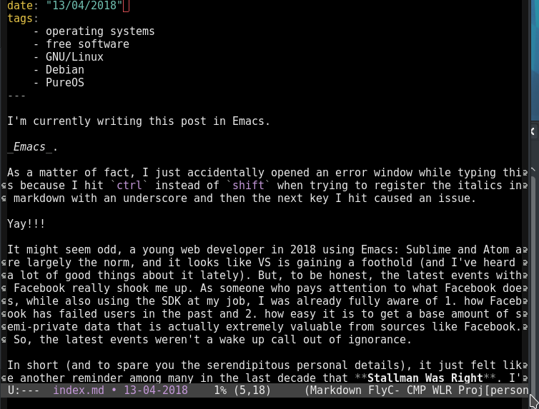

I'm currently writing this post in Emacs.

_Emacs_.

As a matter of fact, I just accidentally opened an error window while typing this because I hit `ctrl` instead of `shift` when trying to register the italics in markdown with an underscore and then the next key I hit caused an issue.

Yay!!!

It might seem odd, a young web developer in 2018 using Emacs: Sublime and Atom are largely the norm, and it looks like VS is gaining a foothold (and I've heard a lot of good things about it lately). But, to be honest, the latest events with Facebook really shook me up. As someone who pays attention to what Facebook does, while also using the SDK at my job, I was already fully aware of both how Facebook has failed users in the past and how easy it is to get a base amount of semi-private data that is actually extremely valuable from sources like Facebook. So, the latest events weren't a wake up call out of ignorance.

In short (and to spare you the serendipitous personal details), it just felt like another reminder among many in the last decade that **Stallman Was Right**. I've been using GNU/Linux for some time to get out of from under the thumb of Microsoft, but it was Ubuntu, and I wanted to see if I could set up my old personal laptop to run on a distro [approved by the Free Software Foundation](https://www.gnu.org/distros/free-distros.en.html). On top of that, I also wanted to begin transitioning to as many GPL-licensed tools as possible.

Hence the Emacs. Of course, the other reason for the jump to Emacs was because I realized that despite embracing all of the most useful Sublime shortcuts, I was still doing a lot of context-switching with my mouse at work, and constantly clicking around. This isn't an Emacs post (maybe I'll revisit that), but I will say that after three full weeks of forcing myself to use nothing but Emacs at my full-time job, the only thing I really miss about Sublime is the superior UX for grepping for a string in a given project.

Anyway, GNU/Linux. Abiding by the FSF's recommendations is semi-arbitrary, and actually sort-of-kind-of-bull-shit. A [redditor recently brought this up](https://www.reddit.com/r/freesoftware/comments/81xpkt/status_of_the_fsf_endorsed_distro_list/), and to give you the tl;dr, essentially, the FSF is here to recommend distros based on their openness: no proprietary or otherwise hidden firmware blobs, no non-free software of any kind, and it must be _impossible_ to use that distro's mirrors to download non-free software; however, the FSF's process of selecting their distros to recommend is both non-democratic **and completely opaque**!

Still, I wanted to take the dive, so I bit, and started out with [PureOS from Purism](https://pureos.net/), a company that makes its money selling completely libre hardware. I personally am using an old Lenovo, which means that no matter which distro I use, I have to use--**_gasp!_**--_non-free firmware_ (an upcoming post will detail what a horror show this is). Since my wifi card is proprietary, none of the FSF recommended distros will install my wifi firmware for me. I have to break the rules, essentially making the whole thing unfree anyway.

To save some time here, I'll just say that I don't understand the point of PureOS very much at all, and other than being something with some branding that Purism can slap on their own machines, I would not recommend it at all. Here are the differences between PureOS and Debian:

1. PureOS mirrors host no non-free software. Debian has a mirror (two, technically) that is _explicitly for_ downloading non-free software.
2. PureOS comes with PureBrowser, their own fork of Firefox that comes with security add-ons installed (note: mine actually didn't come with any installed, but they're add-ons, so whatever).
3. PureOS comes pre-install with TorBrowser (note: again, mine actually didn't come with TorBrowser pre-installed).

... That's it.

(2) and (3) are bull shit reasons to install something like an operating system, especially since there's a huge drawback to PureBrowser: it's _bonkers_ how out of date it is. Even if you are a free software nut, existing on the web means using some proprietary things like Twitter or Slack. The latest release of PureBrowser can't run Slack or several other common web apps. The only way around this is to naughtily force the install of a non-free browser, or cross your fingers and track down one of the other free browsers and hope it works.

Meanwhile, with Debian you can just install Firefox ESR and it's all good.

Then, there's the conceptual issue, one FSF and Stallman seem vehement about, which is (1), that I mentioned above: Debian explicitly mirrors and supports access to non-free software. It's not just out of convenience: it's an ideological decision. One of the core tenants of Debian is to support non-free software. For FSF, by definition, this invalidates Debian's candidacy as something it could ever endorse.

At a certain point, however, even short of asking what "freedom" really means for a user (e.g. a hard philosophical libertarian would say that a truly free system would allow for an individual user to restrict his own freedom with proprietary software if that was what he wanted to do), we have to ask if Debian is really in violation of anything meaningful, even in its explicit support of non-free software.

Take my case, for instance. I never intend to ever ever, never, ever never look at the source code for my wifi adapter. Is my freedom meaningfully inhibited by the fact that I can't sort through all the firmware blobs enabling my card to work? I have a perfectly good laptop and a perfectly good wifi card: I'm not going to up and buy some dongle to carry around just to use something that already works. Granted, it means that getting Debian up and running is going to be a massive pain in the ass where I have to jump through hoops like I'm at the circus just to connect to my own home fucking wi-fi, but still: _that's my right_ no?

Even with all of that said, I haven't enabled the non-free mirror for Debian updates, and I don't intend to do so. I'm typing this on Emacs, previewing my webpage in Firefox ESR, and viewing all of this in a KDE Plasma GUI. Literally the only non-free thing is the wifi firmware I had to manually install, and it is likely to stay that way.

Without being utilitarian about it, I think it's safe to say that if toeing the line of complete freedom inhibits you from being able to conveniently access free software, then acting as if things are black-and-white is undermining the project of access to free software itself. Debian was a pain to install but I'm completely comfortable on the OS (now that I can actually see some goddamn wifi networks), and I have a very tangible sense of freedom that I operate with every time I open it as compared to Ubuntu.

If Debian started off by connecting users up to the non-free mirror, or by default loaded some non-free stuff, it'd be one thing: but users have to go _out of their way_ to add it. I don't think I can stress this enough: _if you want to install non-free software on absolutely anything, **you will find a way to do so**_.

I do wonder if I would have had the same experience if I opted for Trisquel instead of PureOS as many recommended, but regardless of the particulars of the FSF-approved choices, what I find interesting is what they have _not_ approved, both in terms of the lack of transparency in the process, and in their alarmingly rigid approach.
